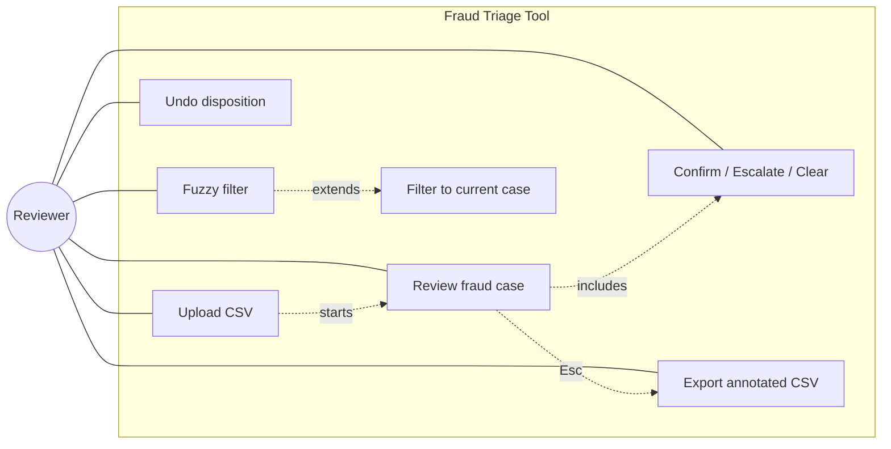
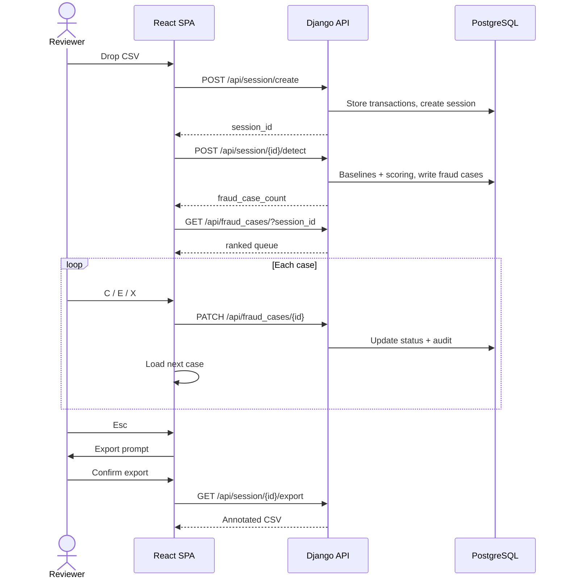

# Fraud Triage — Implementation Plan

## Architecture
A lightweight, self-contained fraud triage tool. State is session-scoped (no accounts), and the stack is modular so other teams can adapt the detection layer to their own rules.
**Stack**
- **Backend**: Django REST API (Python) — fraud detection, per-card baselines
- **Database**: PostgreSQL — transactions, fraud cases, session state, audit trail
- **Frontend**: React + TypeScript SPA — keyboard-driven review queue
- **Deployment**: Docker Compose — one-command startup

## Frontend use case
Reviewer-facing actions and how they map to the system. The reviewer drives everything from the keyboard.



## Frontend flow

One screen, one case. Case content swaps in place — no page navigation.



## Frontend UX
**Case view**: risk score (color-coded), 1–3 heuristic reasons, collapsed transaction log (expand with `L`).

Reasons use the fixed format: `<SIGNAL> — <evidence>. Baseline <x> → observed <y> (<factor>).`

**Keyboard map**

| Key   | Action                         |
| ----- | ------------------------------ |
| `C`   | Confirm (ACCEPTED)             |
| `E`   | Escalate (ESCALATED)           |
| `X`   | Clear (REJECTED)               |
| `N`   | Next case                      |
| `U`   | Undo last disposition          |
| `/`   | Fuzzy filter                   |
| `Esc` | Return to menu → export prompt |

**Fuzzy filter** (`/`) searches across card_id, merchant_name, and device_id. A case-specific mode narrows the view to everything flagged for the current case.

**Export prompt**: pressing `Esc` returns to the menu and surfaces a clickable export option. Confirming writes the annotated CSV — original columns verbatim, plus `flag_score`, `flag_reasons`, `review_status`, `disposition`, `reviewer`, `reviewed_at`. Each transaction row carries the `fraud_case_id`(s) it belongs to, so the file round-trips cleanly.

**Readability**: high contrast, 16px+ body text, 1.5em line-height.

## Backend routes
No login. A `session_id` is created on CSV upload, and all data is scoped to it. Sessions inactive for 24h are cleaned up.

| Method  | Route                                 | Purpose                                                             |
| ------- | ------------------------------------- | ------------------------------------------------------------------- |
| `POST`  | `/api/session/create`                 | Ingest CSV, create session → `{ session_id, transaction_count }`    |
| `POST`  | `/api/session/{id}/detect`            | Run baselines + scoring, write fraud cases → `{ fraud_case_count }` |
| `GET`   | `/api/fraud_cases/?session_id=X`      | Ranked queue → `[ { id, risk_score, reasons } ]`                    |
| `GET`   | `/api/fraud_cases/{id}/?session_id=X` | Case detail → `{ case, linked_transactions }`                       |
| `PATCH` | `/api/fraud_cases/{id}/`              | Set `{ status, reviewer_notes }`, write audit fields                |
| `GET`   | `/api/session/{id}/export`            | Annotated CSV download                                              |

## Backend implementation
**Data model** (PostgreSQL, mirrors the schema doc):
- `transactions` — raw rows, scoped by `session_id`
- `fraud_cases` — `id`, `risk_score`, `status`, `heuristic_notes_json`, `reviewer`, `reviewer_notes`, `timestamp`
- `fraud_case_transaction` — M:M junction linking cases to transactions
- `session_state` — dismissals and queue sort order, scoped by `session_id` (kept here so re-ranking does not re-derive on every fetch)

**Detection strategy**
Per-card baselines, computed once per session:
- Amount: flag if outside median ± 2×IQR
- Category / geography: flag merchant_category or merchant_country never seen on this card
- Device / IP: flag first appearance of a device_id or ip_address
- Velocity: flag >5 transactions in 1h on one card

Cross-card signals (the pattern invisible without aggregation):
- Device reuse: device_id on 3+ cards → flag all its transactions
- IP reuse: same logic
- Merchant burst: >10 transactions in 1h at one merchant → flag the window

`risk_score` is a weighted sum of fired heuristics, clamped to [0, 100]. Weights tuned for F1 ≥ 0.85 (see hypothesis log).

**Dismissal feedback loop**
Clearing a flag (`X`) records the dismissal in `session_state`. On the next case load, the queue re-ranks: heuristics matching the dismissed signal type lose 30% weight (tunable) for the rest of the session.

## Work division
- **Merrick** — frontend, session API, CSV export, keyboard UX
- **Matthew** — backend, per-card baselines, cross-card aggregation, tests

**Phasing**
1. Design (h0–4): agree on heuristics, wireframe the queue
2. Parallel build (h4–18): Matthew on detection (Jupyter → Python module); Merrick on the SPA and API contract
3. Integration (h18–22): wire endpoints, export, keyboard flow
4. Polish (h22–24): README, tests, hypothesis log, one-command run

## Out of scope
Authentication, accounts, encryption, multi-user collaboration, ML training, real-time streaming, graph visualization, and full compliance reporting. The contract is CSV in, annotated CSV out.

## Run
```bash
git clone <repo>
cd fraud-triage
docker-compose up   # API :8000, frontend :3000
```