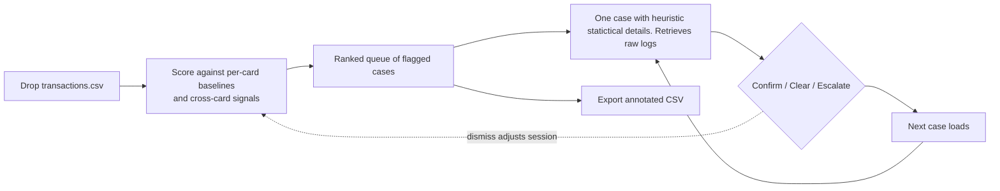
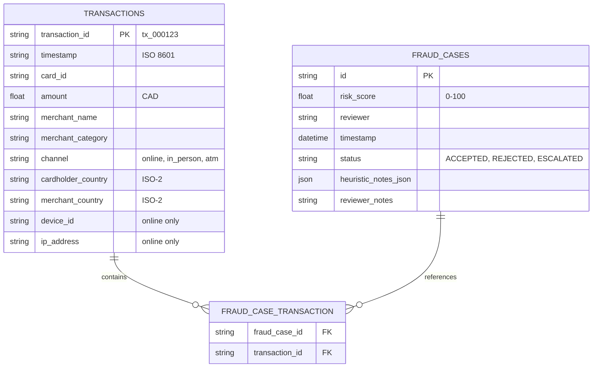

# Fraud Triage — Product Requirements

> **A tool, not an app.** CSV in, dispositions out, the reviewer is the pipe. One screen, one decision at a time, hands on the keyboard.

---
## Design philosophy

The product is a _tool_, not an application. A tool does one thing, asks for nothing, and disappears into the task. You don't log into a knife. The concrete rules this produces:
- **No login, no landing, no dashboard.** Drop a CSV and you are in the queue.
- **The keyboard is the interface.** The mouse is optional, never required.
- **One screen, one case.** The reviewer never navigates through different pages.
- **No state you can't export.** Your work product is the returned CSV, not an account.
- **Nothing blinks, notifies, or upsells.**

---
## User

| Who                 | Why                                                                                            |
| ------------------- | ---------------------------------------------------------------------------------------------- |
| **Who**             | James, a trust & safety reviewer at a payments company                                         |
| **Job**             | Manually triage transactions the system has flagged: confirm, clear, or escalate               |
| **Context**         | Long sessions of repetitive review; throughput and low strain matter more than power features. |
| **Technical level** | Non-technical, must be productive cold, with zero instructions.                                |
| **What he needs**   | To trust each flag's reasoning at a glance and move to the next case in seconds                |


## The job



---

## What the tool detects
Detects deviations from baseline values; the card's own normal, patterns visible across all cards. The dataset carries `device_id`, `ip_address`, `merchant_name`, `card_id` these are used to make correlations. Can detect:
- **Amount anomaly** — transaction vs. the card's own median and spread
- **Category / geography novelty** — a merchant category or country this card has never used
- **New device or IP** — first appearance of a `device_id` / `ip_address` on this card
- **Cross-card reuse** — one `device_id` or `ip_address` spanning multiple cards _(invisible without aggregating across cards)_
- **Velocity** — a burst of transactions in a short window

Every flag carries at least one human-readable reason in a fixed format:
```
<SIGNAL> — <evidence>. Baseline <x> → observed <y> (<factor>).
```
- `Amount anomaly — $750 vs card median $52 (14×).`
- `Cross-card device reuse — device_4f2a on 6 cards. Baseline 1 → 6.`
- `New geography — merchant_country RO; cardholder CA; no prior RO activity.`

A case shows its 1–3 reasons and score up front; the full raw transactions logs are visually separated to prevent a wall of fields.

---

## Reviewer experience
- **Queue, not a table.** Cases appear one at a time, ranked by score, with full context.
- **Keyboard-first.** Confirm / Clear / Escalate / Next on single keys; the next case auto-loads. Visible focus, no keyboard traps.
- **Undo.** Any disposition is reversible.
- **One filter.** A single keyboard-invoked fuzzy filter (by card, merchant, device) and no filter panel.
- **Lightweight in-session feedback.** Dismissing a flag suppresses similar flags for the rest of the session and records the dismissal.
- **Readable by default.** High-contrast, comfortable text size and spacing for sustained sessions  accessibility as table-stakes, not a feature.

---

## Export contract
The returned CSV is the deliverable. Original columns preserved, review columns appended. It reloads cleanly (round-trip safe).

|Column|Source|
|---|---|
|_(original columns)_|Input, verbatim|
|`flag_score`|Detector|
|`flag_reasons`|Detector (the formatted reason strings)|
|`review_status`|Reviewed / Pending|
|`disposition`|Confirmed fraud / Cleared / Escalated|
|`reviewer` + `reviewed_at`|Lightweight audit trail|

---

## Success looks like
- **Detection** — F1 ≥ 0.85 against the hidden key, precision protected (no over-flagging).
- **Speed** — a flag dispositioned in seconds, hands never leaving the keyboard.
- **Cold start** — a non-technical reviewer dispositions their first case with no instructions.
- **Explainability** — every flag carries at least one reason in the locked format.
- **Handoff** — the export reloads cleanly and **carries status, risk, reasons, reviewer, and timestamp.**

## Not building
- Graph/network ML, real-time streaming, model training
- Enterprise scale, multi-user collaboration, accounts
- Integrations or connectors. The contract is CSV in, CSV out.
- Full compliance reporting (lightweight audit trail only).
- Any dashboard, landing page, or onboarding flow, excluded by philosophy, not by time

## If we had another week
A visual cross-card graph of shared devices/IPs; thresholds that persist and learn across sessions; a full free-browse log navigator; additional signal families, each backtested for its F1 contribution.

# Database schema

## Mermaid ERD



## Heuristic Notes JSON Schema

```json
{
  "velocity_check": {
    "heuristic_name": "tx_count_24h",
    "text": "Transaction count per 24h is 10x more than baseline",
    "status": "flagged"
  },
  "mcc_mismatch": {
    "heuristic_name": "merchant_category_shift",
    "text": "Merchant category deviation from cardholder history",
    "status": "flagged"
  },
  "geographic_anomaly": {
    "heuristic_name": "impossible_travel",
    "text": "8400 km in 3 hours between transaction locations",
    "status": "flagged"
  }
}
```

## Notes

- **FraudCaseTransaction** is the junction table — M:M relationship between transactions and cases
- **risk_score** (0-100) is computed from heuristic_notes flagged status and weights
- **status** controls case lifecycle: ACCEPTED (confirmed fraud), REJECTED (false positive), ESCALATED (manual review needed)
- **heuristic_notes_json** stores flagged heuristics with human-readable text; keys are heuristic instance IDs, values follow {heuristic_name, text, status}